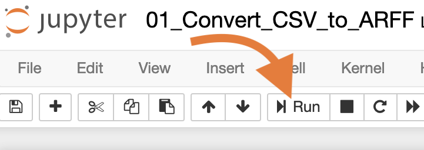

# 실행 방법 문서

## 필요한 소프트웨어
***설치를 해야합니다!***
- `docker` :whale:
- `docker-compose`

### 실행 환경
- Python 3.6 (conda) :snake:
- jupyter notebook :notebook:

### 실행 환경 만들기
> ***시간이 꽤 소요됩니다.*** 
- docker-compose
```bash
git clone https://github.com/jazz4rabbit/kakaopay-hw
cd kakaopay-hw
docker-compose up -d
```  
> 이후, 웹브라우저에 `127.0.0.1:1088`입력, 비밀번호: `muzi`입력하면, 코드를 실행해 볼 수 있습니다.
- 1088포트를 사용중인 경우 port 설정이 필요합니다. (기본 값은 `1088`입니다.)  
  `.env` 파일에서 `PORT`에 원하시는 port 숫자로 변경해야 합니다.

#### 실행 방법 및 순서
- 위의 처럼 환경을 구축 후에 `jupyter notebook`에서 아래의 4개의 파일을 순차적으로 실행하시면 됩니다.  
  `shift + enter`나 아래 그림의 `Run` 버튼을 클릭하면 코드가 실행됩니다.
   
- [`01_Convert_CSV_to_ARFF.ipynb`](../work/01_Convert_CSV_to_ARFF.ipynb)  
    - csv파일을 arff파일로 변환합니다.
    - train, test 데이터 분리를 진행합니다.
- [`02_Feature_Selection.ipynb`](../work/02_Feature_Selection.ipynb)
    - *이 부분은 진행하지 않고 03번으로 진행해도 됩니다. 특징분석을 위해 진행했습니다.*
    - 특징 분포 출력합니다.
    - 그리고 특징간의 산점도 그림을 출력합니다.
    - CFS 기반의 특징선택 알고리즘을 적용하여 어떤 특징이 선택되는지 확인합니다.
- [`03_Predict_Model.ipynb`](../work/03_Predict_Model.ipynb)
    - 모델 학습을 진행합니다.
    - 모델 평가를 진행합니다.
    - 사용한 모델: 선형회귀, 랜덤 포레스트, SMOreg (회귀를 위한 SVM, support vector machine 알고리즘) 입니다.
- [`04_Final_Model.ipynb`](../work/04_Final_Model.ipynb)
    - 최종 모델: SMOreg (+ RBF kernel) 입니다.
    - 하나의 자료를 최종 모델로 예측합니다.
