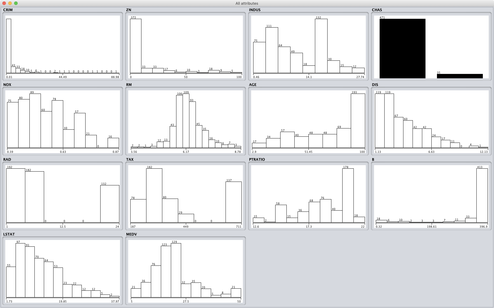

# 데이터 속성별 탐색 과정
## 특징의 분포
데이터 특징의 분포와 실수형 통계자료는 다음과 같습니다. `CRIM`, `ZN`, `B`, `CHAS`의 특징들은 한쪽 방향에 많이 쏠려 있다는 것을 알 수 있습니다.

| | CRIM       | ZN       | INDUS      | NOX      |  RM        |  AGE       |  DIS        |
|:-------|-----------:|---------:|-----------:|---------:|-----------:|-----------:|-------------|
| Min    | 0.00632    | 0        | 0.46       | 0.389    | 3.561      | 2.9        |  1.1296     |
| Max    | 88.9762    | 100      | 27.74      | 0.871    | 8.78       | 100        |  12.1265    |
| Sum    | 1336.5263  | 3917     | 3943.76    | 197.0906 | 2228.646   | 24442.5    |  1344.9029  |
| SumSq  | 35693.7519 | 227072.5 | 60457.3646 | 114.4775 | 14206.2915 | 1962061.09 |  6700.3974  |
| Mean   | 3.7755     | 11.0650  | 11.1406    | 0.5568   | 6.2956     | 69.0466    |  3.7992     |
| StdDev | 9.3178     | 22.8141  | 6.8413     | 0.1160   | 0.7053     | 27.8802    |  2.1229     |

| | RAD    | TAX      | PTRATIO    | B             | LSTAT      | MEDV      |
|:-------|-------:|---------:|-----------:|--------------:|-----------:|----------:|
| Min    | 1      | 187      |  12.6      | 0.32          | 1.92       | 5         |
| Max    | 24     | 711      |  22        | 396.9         | 37.97      | 50        |
| Sum    | 3436   | 144950   |  6509.3    | 125781.09     | 4480.87    | 7969.1    |
| SumSq  | 60628  | 69432122 |  121427.03 | 47691819.5247 | 74248.4595 | 210089.95 |
| Mean   | 9.7062 | 409.4633 |  18.3879   | 355.3138      | 12.6578    | 22.5116   |
| StdDev | 8.7905 | 168.9864 |  2.2170    | 92.1887       | 7.0471     | 9.3246    |

## 집값 예측을 위한 특징선택 동기
아래 그림의 `CRIM`(범죄율) vs. `MEDV`(집값) 산점도와 `TAX`(세금) vs. `MEDV` 산점도를 주목해 봅시다. 산점도에서 MEDV 값이 높을 수록 점의 색이 밝아 집니다.

`CRIM` vs. `MEDV` 산점도에서 (범죄율)이 15보다 크면, 집값이 낮은 경향을 띄는 것을 보입니다. 마찬가지로 `TAX`가 700 보다 큰 경우와 450 근처에서는 집값이 낮은 경향을 보입니다.

이번에는 아래의 `CRIM`과 `TAX`의 산점도를 주목해봅시다. `CRIM`이 0이고, `TAX`가 280\~290이면 `MEDV`가 낮은 경향이 보이고, `TAX`가 660정도이고 `CRIM`이 약 5\~8이면 `MEDV`가 낮은 경향을 보입니다.

저는 집값에 대한 배경지식이 많지 않기 때문에, 이러한 이유가 발생하는 이유를 알기 어렵습니다. 따라서, 특징선택 알고리즘의 도움을 받아 특징을 선택했습니다.

### CFS (Correlation Based Feature Selection)
- Correlation 기반의 특징선택 방법은 관련없는 속성과 중복된 속성을 모두 제거하는 알고리즘입니다. 따라서, 이 알고리즘으로 부터 얻은 특징들은 중복된 속성과 예측을 위해 관련없는 특징들을 가늠해 볼 수 있습니다.

  
여기서, `S_k`는 선택된 `k`개의 특징의 부분집합을 나타내고, 는 `S_k`의 특징들과 예측 클래스의 상관관계의 평균을 나타내고, 는 `S_k`의 특징들간의 상관관계의 평균을 나타냅니다.  

#### CFS 기반의 `S_k` 탐색
`S_k`를 찾는 방법에는 `BestFirst` 방법을 적용했습니다.
-  `BestFirst`
  - 특징의 부분집합들을 전진 선택, 후방 제거, 단계적(양방향) 방법을 통해 탐색합니다.  
    현재 가장 좋은 부분집합에서 merit이 연속적으로 개선되지 않는 수 `N`을 넘으면 탐색을 종료한다.
  - `N`은 5로 설정해서 탐색했습니다.

CFS 알고리즘 수행결과는 다음과 같습니다. (merit는 높을 수록 중복된 특징과 관련없는 속성이 없다는 것을 의미합니다.)

1. 전진 선택과 단계적 방법(공집합 시작)
    - merit: 0.78
    - 선택된 특징들 (4개): `CHAS`, `RM`, `PTRATIO`, `LSTAT`
2. 후방 제거과 단계적 방법(모든 특징선택후 시작)
    - merit: 0.528
    - 선택된 특징들 (11개): `CRIM`, `ZN`, `INDUS`, `CHAS`, `NOX`, `RM`, `AGE`, `TAX`, `PTRATIO`, `B`, `LSTAT`

CFS 알고리즘으로 부터 얻을 수 있는 결론은 집값 예측을 위한 특징들의 중복된 속성이 많았다는 것을 의미합니다. 위의 산점도 그림에서 `CRIM`가 높을 수록 `MEDV`가 낮은 관계가 있었습니다. 전진 선택 또는 단계적 방법으로 부터 얻은 특징에는 `CRIM`이 없는 것으로 보아 중복된 특징이 있음을 알 수 있습니다.
따라서, CFS 특징선택 알고리즘을 적용한 모델과 전체 특징을 사용한 모델 두 가지를 고려할 것입니다.

# 집값 예측 모형 개발 단계별 고려 사항
집값은 실수형 자료이기 때문에, 이에 적절한 머신러닝 알고리즘을 사용하기로 했습니다.
Weka에서 실수형 자료를 예측하는 머신러닝 알고리즘으로는 `선형 회귀`, `랜덤 포레스트`, `SMOreg` 등이 있습니다.
`SMOreg`는 회귀를 위한 `SVM`(support vector machine) 알고리즘입니다. 위 세 가지 모델로 집값 예측 모형을 적용할 것입니다.
`집값`이라는 것이 다른 인자와 선형관계를 가진다면, 선형 회귀는 적절한 모델일 수 있습니다. 만약 선형 회귀 모델이 부적절하다면 랜덤 포레스트나 SMOreg 알고리즘이 적절한 모델을 구성할 수 있습니다. SMOreg도 SVM 알고리즘 기반이기 때문에 선형 회귀이지만, 커널 트릭을 이용하여 비선형 회귀를 가능하게 합니다. 또한, 랜덤 포레스트도 랜덤 트리의 앙상블 기법이므로 적절한 비선형 모델이 구성될 수 있습니다.

## CFS 특징선택 고려 제외: `랜덤 포레스트`, `선형 회귀`
- 선형 회귀의 경우 `M5`라는 방법으로 특징을 제거하는 방법을 사용합니다.
- 메뉴얼에 의하면 Akaike information criterion으로 관측값의 에러를 추정하여, 가장 작은 smallest standardised coefficient가 향상되지 않을 때까지 특징을 지운다고 합니다.
- `랜덤 포레스트`의 경우는 여러 결정트리들의 앙상블 기법 중 하나인 배깅과 랜덤 노드 최적화 기법을 사용합니다.
- 랜덤 노드 최적화 기법으로 중요한 특징을 `int(log_2 (특징 개수)) + 1` 선택하여 모델을 구성하게 됩니다.
- Weka에서는 이 수를 `-K` 으로 조절할 수도 있습니다.
- 그래서 랜덤 포레스트를 잘 최적화해주는 특징선택이 있기 때문에 CFS 특징선택을 제외합니다.

## CFS 특징선택 적용: `SMOreg`
- 위 두 알고리즘은 적절한 특징을 제거하는 기법으로 CFS 특징선택 알고리즘을 적용합니다.  
  CFS에서 전진 선택으로 얻은 특징이 4개이기 때문에, 집값을 예측하는데 굉장히 힘들 수 있습니다. 그래서, 후진 제거 방법으로 얻은 결과의 특징을 선택하여 모델을 구성할 것입니다.
- SMOreg의 경우 커널트릭을 이용해, 비선형 모델을 구성할 수 있습니다.
- 여기서는 RBF(방사기저함수) kernel을 이용하여 모델을 구성합니다. (일반적으로, RBF 커널이 우수한 성능을 보입니다.)
- 또한, 특징선택 알고리즘을 적용하지 않은 결과와도 비교합니다.

## 모델 평가 방법
- 모델의 평가 방법은 `RMSE`를 사용하여 평가합니다.
- 모델이 예측한 결과가 실제 테스트 결과와 크게 벗어난다면 RMSE의 값이 커지기 때문에 모델이 성능이 좋지 않다는 것을 크게 반영하게 됩니다.
- 이러한 이유로 RMSE 측도로 모델의 성능을 상대적으로 비교할 것입니다. (RMSE가 클 수록 모델의 성능이 좋지않다는 것을 의미합니다.)
