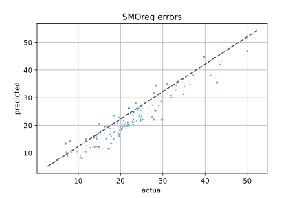

# 예측 모델 성능 평가 (03_Predict_Model)

## 모델에 따른 평가지표
| `모델과 평가지표`               | 선형 회귀   | 랜덤 포레스트 | SMOreg (+RBF kernel) | SMOreg (+RBF kernel +CFS) |
|:----------------------------|----------:|----------:|---------------------:|--------------------------:|
| Correlation coefficient     | 0.8819    | 0.9516    | `0.9622`               | 0.9571                    |
| Mean absolute error         | 3.0827    | 2.1429    | `1.9082`               | 1.9829                    |
| `Root mean squared error`   | 4.2220    | 2.8268    | `2.4383`               | 2.6041                    |
| Relative absolute error     | 47.1436 % | 32.7702 % | `29.1811 %`            | 30.3239 %                 |
| Root relative squared error | 47.4706 % | 31.7830 % | `27.4155 %`            | 29.2796 %                 |

- 모델 평가 방법: RMSE 기준으로 선택합니다.  
- 따라서, 최종 집값 예측 모델은 `SMOreg (+RBF kernel)`입니다.  
  다른 지표들도 SMOreg 가 가장 좋은 것을 만족합니다.  
  랜덤 포레스트와 SMOreg 모델들은 거의 비슷한 성능을 내는 것을 확인 할 수 있습니다.


아래의 그림 자료들은 실제 데이터와 예측한 데이터의 에러를 그래프로 표현한 것입니다. `x`축은 실제 데이터의 값이고, `y`축은 해당 모델로 예측한 데이터의 값입니다.
따라서, `y=x`에 데이터가 있을 수록 모델의 성능이 좋다고 볼 수 있습니다. 

아래의 그림에 dash line 설명이 없는데, 아마도 에러 그래프에서 회귀 직선을 그린 것을 나타내는 것으로 보입니다. SMOreg (+RBF)의 회귀직선은 `y=x`보다 약간 위쪽에 있습니다. 이는 예측값이 실제값보다 약간 집값을 비싸게 예측하는 경향이 있다는 것을 나타냅니다. 따라서, 실제로 이 모델을 적용한다면 이러한 사항들을 이해하고 있어야 합니다.

## 선형 회귀


```
Correlation coefficient                  0.8819
Mean absolute error                      3.0827
Root mean squared error                  4.222 
Relative absolute error                 47.1436 %
Root relative squared error             47.4706 %
```

## 랜덤 포레스트


```
Correlation coefficient                  0.9516
Mean absolute error                      2.1429
Root mean squared error                  2.8268
Relative absolute error                 32.7702 %
Root relative squared error             31.783  %
```

## SMOreg (특징선택 적용하지 않음)


```
Correlation coefficient                  0.9622
Mean absolute error                      1.9082
Root mean squared error                  2.4383
Relative absolute error                 29.1811 %
Root relative squared error             27.4155 %
```

## SMOreg (특징선택 적용: CSF 후진 제거 방법 적용)


```
Correlation coefficient                  0.9571
Mean absolute error                      1.9829
Root mean squared error                  2.6041
Relative absolute error                 30.3239 %
Root relative squared error             29.2796 %
```
